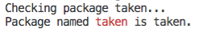
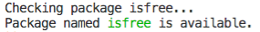

# mnp

[](https://www.npmjs.com/package/mnp)

`mnp` aka _My New Package_ is a Node.JS CLI binary that allows to quickly create new _Node.js_ (or any other language) packages from _GitHub_ templates and with a _GitHub_ repository.

MNP provides a number of modern essential templates for package and web development with default structures (`src`, `test`, `package.json`, _etc_).

- <kbd>📦 [Package Template](../../wiki/Package-Template)</kbd>: the most essential _Node.JS_ package structure with automated documentation and wiki pages, context and mask testing, 0-dependency import/export transpiler and _Closure Compiler_ integration to properly compile Node.JS packages.
- <kbd>🥝 [Splendid Template](../../wiki/Splendid-Template)</kbd>: vital static website generator that utilises Closure Stylesheets to minify CSS, supports JSX syntax for Preact components and statically rendered HTML.

But in addition to the provided templates, you can point to your own _GitHub_ template, which will contain the installation script. The installation script receives access to the API and allows to ask additional questions, e.g.,

```js
// mnp/index.js
export default {
  questions: {
    website: {
      text: 'Website',
      getDefault({ org, name }) {
        return `https://${org}.github.io/${name}`
      },
      async afterQuestions({ github }, answer, { org, name }) {
        await github.pages.enable(org, name, {
          branch: 'master',
          path: '/docs',
        })
      }
    }
  }
}
```

<p align="center"><a href="#table-of-contents">
  
</a></p>

## Table Of Contents

- [Table Of Contents](#table-of-contents)
- [CLI: `mnp my-new-package`](#cli-mnp-my-new-package)
  * [Creating Packages](#creating-packages)
  * [`-I`, `--init`: Configure](#-i---init-configure)
    * [`Settings`](#type-settings)
  * [`-h`, `--help`: Show Help](#-h---help-show-help)
  * [`-c`, `--check`: Check Exists](#-c---check-check-exists)
  * [`-d`, `--delete`: Delete Repository](#-d---delete-delete-repository)
  * [`-@`, `--scope`: Set Scope](#----scope-set-scope)
  * [`-n`, `--no-scope`: Disable Scope](#-n---no-scope-disable-scope)
- [Templates](#templates)
  * [Writing Scripts](#writing-scripts)
- [Copyright](#copyright)

<p align="center"><a href="#table-of-contents">
  
</a></p>

## CLI: `mnp my-new-package`

The default mode is to start creating a package. If `package-name` is not passed, the program will run in interactive mode and ask to enter details.

To use the binary, enter `mnp cool-package-name`, or just `mnp` to be asked for the name. `mnp` will check if the directory name is not taken and that the current working directory ins not in a git path, generate a new `Github` repository from the template, star it and clone it to the local filesystem.

The default template used is `mnpjs/package` however it can be either overridden in [settings](#type-settings) during initialisation, or via the `-t org/template` flat.

<table>
<tbody>
<tr>
</tr>
<tr>
<td><a name="creating-packages">Creating Packages</a></td>
</tr>
<tr>
<td></td>
</tr></tbody></table>

<p align="center"><a href="#table-of-contents">
  
</a></p>

### `-I`, `--init`: Configure

When launched for the first time, `mnp` will ask to complete the set-up process and create a `.mnprc` file in the directory from which it was called. It is possible to create a default `.mnprc` in the `HOME` directory to remember the token and other standard settings, and then initialise `mnp` in other directories, then _MNP_ will reuse the settings from the `HOME` config, but ask for more details for the current folder. This way, it is easy to manage different organisations and scopes, while reusing the access token.

__<a name="type-settings">`Settings`</a>__
<table>
 <thead><tr>
  <th>Name</th>
  <th>Type &amp; Description</th>
  <th>Default</th>
 </tr></thead>
 <tr>
  <td rowSpan="3" align="center"><strong>token*</strong></td>
  <td><em>string</em></td>
  <td rowSpan="3">-</td>
 </tr>
 <tr></tr>
 <tr>
  <td>
   The <code>GitHub</code> <a href="https://github.com/settings/tokens">personal access token</a>.
  </td>
 </tr>
 <tr>
  <td rowSpan="3" align="center"><strong>org*</strong></td>
  <td><em>string</em></td>
  <td rowSpan="3">-</td>
 </tr>
 <tr></tr>
 <tr>
  <td>
   The <code>GitHub</code> organisation name to create repositories for. For personal accounts, the username should be used.
  </td>
 </tr>
 <tr>
  <td rowSpan="3" align="center"><strong>scope*</strong></td>
  <td><em>string</em></td>
  <td rowSpan="3">-</td>
 </tr>
 <tr></tr>
 <tr>
  <td>
   The NPM scope with which to create packages.
  </td>
 </tr>
 <tr>
  <td rowSpan="3" align="center">template</td>
  <td><em>string</em></td>
  <td rowSpan="3"><code>mnpjs/package</code></td>
 </tr>
 <tr></tr>
 <tr>
  <td>
   The default template.
  </td>
 </tr>
 <tr>
  <td rowSpan="3" align="center"><strong>name*</strong></td>
  <td><em>string</em></td>
  <td rowSpan="3">-</td>
 </tr>
 <tr></tr>
 <tr>
  <td>
   The author's name to set in the <code>package.json</code> file, and in the project directory's git config (default is looked up in global git config).
  </td>
 </tr>
 <tr>
  <td rowSpan="3" align="center"><strong>email*</strong></td>
  <td><em>string</em></td>
  <td rowSpan="3">-</td>
 </tr>
 <tr></tr>
 <tr>
  <td>
   The author's email to set in the <code>package.json</code> file, and in the project directory's git config (default is looked up in global git config).
  </td>
 </tr>
 <tr>
  <td rowSpan="3" align="center"><strong>website*</strong></td>
  <td><em>string</em></td>
  <td rowSpan="3">-</td>
 </tr>
 <tr></tr>
 <tr>
  <td>
   The link location in the copyright section of the <em>README</em> file.
  </td>
 </tr>
 <tr>
  <td rowSpan="3" align="center"><strong>trademark*</strong></td>
  <td><em>string</em></td>
  <td rowSpan="3">-</td>
 </tr>
 <tr></tr>
 <tr>
  <td>
   The display text for the website link in the <em>README</em>.
  </td>
 </tr>
 <tr>
  <td rowSpan="3" align="center"><strong>legalName*</strong></td>
  <td><em>string</em></td>
  <td rowSpan="3">-</td>
 </tr>
 <tr></tr>
 <tr>
  <td>
   The official legal name for placement in the <em>LICENSE</em> file.
  </td>
 </tr>
 <tr>
  <td rowSpan="3" align="center"><strong>manager*</strong></td>
  <td><em>string</em></td>
  <td rowSpan="3">-</td>
 </tr>
 <tr></tr>
 <tr>
  <td>
   Package manager, such as <code>yarn</code> or <code>npm</code>.
  </td>
 </tr>
</table>

<details>
  <summary>Initialising configuration: <code>mnp -I</code>.</summary>
  <table>
  <tr><td>
    
  </td></tr>
  </table>
</details>

<p align="center"><a href="#table-of-contents">
  
</a></p>

### `-h`, `--help`: Show Help

<table>
<tbody>
<tr></tr>
<tr>
<td>

```
MNP: create My New Package.
 If no package name is given as the first argument, the program will ask
 for it in the CLI. A GitHub repository for each new package will be
 created automatically, and a GitHub token can be generated at:
 https://github.com/settings/tokens for the use in this application.
 The token is saved in the CWD/.mnprc file along with other configuration,
 including organisation name etc. Different types of packages, with a
 modern Node.JS library by default are available, including:

package:	a modern Node.JS package to publish on npm (default)
		https://github.com/mnpjs/package
splendid:	a static website using Splendid
		https://github.com/mnpjs/splendid

  mnp [name] [-t template] [-D description] [-@ scope|-n] [-pcId] [-hv]

	name          	The name of the new package.
	--template, -t	The template to generate from.
	              	Default: mnpjs/package.
	--private, -p 	Create a private repository.
	--desc, -D    	The description to add.
	--check, -c   	Just query NPM registry to see if the package exists.
	--delete, -d  	Remove the repository from GitHub.
	--init, -I    	Initialise MNP config in this directory, creating .mnprc.
	--no-scope, -n	Don't use a scope for this package.
	--scope, -@   	Use this specific scope for the package.
	--help, -h    	Print the help information and exit.
	--version, -v 	Show the version's number and exit.

  Example:

    mnp my-new-package -t org/template
```
</td>
</tr>
</tbody>
</table>

<p align="center"><a href="#table-of-contents">
  
</a></p>

### `-c`, `--check`: Check Exists

Check if the package name is already taken or not.

|     Command     |             Output             |
| --------------- | ------------------------------ |
| `mnp taken -c` |  |
| `mnp isfree -c` |    |

<p align="center"><a href="#table-of-contents">
  
</a></p>

### `-d`, `--delete`: Delete Repository

Delete specified repository from `GitHub`. Useful when a package was created for testing. The organisation name will be read from the configuration.

```sh
mnp package -d
```

<p align="center"><a href="#table-of-contents">
  
</a></p>

### `-@`, `--scope`: Set Scope

When a particular scope needs to be specified for the package, the `-@` option can be used.

```sh
mnp package -@ superscope
```

<p align="center"><a href="#table-of-contents">
  
</a></p>

### `-n`, `--no-scope`: Disable Scope

If the settings read from `.mnprc` contained an NPM scope, but it is not needed for the particular package, it can be disabled with this option.

```sh
mnp package -n
```

<p align="center"><a href="#table-of-contents">
  
</a></p>


## Templates

When the structure is passed as `org/name`, _MNP_ will use that template to create a new package. This means you can use your own templates and exploit the functionality of _MNP_. Everything that is published on _GitHub_, will be present in the new repository.


### Writing Scripts

The installation scripts are essential to update the newly created structure to the correct values. Upon installation, `mnp` will create a list of all files in the project directory, so that any transformations will be run on them. A braces `{{ repo }}` templating notation is used in files for the replacement of settings. By default, the following files are added:

- files: `['LICENSE', '.gitignore', '.eslintrc']`
- extensions: `['js', 'jsx', 'md', 'html', 'json', 'css', 'xml']`

But this can be overriden by scripts:

```js
// mnp.js
export default {
  files: {
    extensions: ['txt'], // override
    extensions(ext) {
      return [...ext, 'txt']
    }, // extend
    filenames: ['COPYING'], // override
    filenames(fn) {
      return [...fn, 'COPYING']
    }, // extend
  },
}
```

**script structure**

The script should be placed in the `mnp/index.js` or `mnp.js` file in the template. It should export default object, and can use Node.JS API:

```js
export default {
  // add some MNP questions
  mnpQuestions: ['wiki', 'license', 'homepage', 'keywords'],
  questions: {
    binary: {
      confirm: true,
      text: 'With binary',
      async afterQuestions({ rm, removeFile, updateFiles, packageJson, updatePackageJson }, withBinary) {
        if (withBinary) return
        delete packageJson.bin
        updatePackageJson(packageJson)
        await updateFiles({
          re: /\nlet BIN[\s\S]+/,
          replacement: '',
        }, { file: 'test/context/index.js' })
      },
    },
  },
  async preUpdate({ repo: { owner: { avatar_url } } }, { updateFiles }) {
    await updateFiles({
      re: 'https://avatars3.githubusercontent.com/u/38815725?v=4',
      replacement: avatar_url,
    }, { file: '.documentary/index.jsx' })
  },
  async afterInit({ name }, { renameFile, initManager }) {
    renameFile('compile/bin/mnp.js', `compile/bin/${name}.js`)
    renameFile('compile/mnp.js', `compile/${name}.js`)
    renameFile('compile/mnp.js.map', `compile/${name}.js.map`)
    renameFile('src/bin/mnp.js', `src/bin/${name}.js`)
    renameFile('build/bin/mnp.js', `build/bin/${name}.js`)
    await initManager()
  },
}
```

**questions**

The questions are specified as a hash map, and the logic should be handled in the `afterQuestions` function. These functions receive the [MNP API](https://github.com/mnpjs/mnp/blob/master/src/lib/api.js) as the first argument, then the answer, then all settings. We're working on making autocompletions available.

**mnpQuestions**

These are standard questions that can benefit any new package.

- `wiki`: if set, will initialise the wiki submodule in the project dir.
- `license`: allows to [pick a license](https://github.com/mnpjs/licenses), update `package.json` with its SPDX and add the license file into the project.
- `homepage`: asks for the homepage to add to `package.json` and sets the `GitHub` URL if given.
- `keywords`: creates an array of keywords to add to `package.json` and sets `GitHub` topics.

**hooks**

There are a number of hooks executed at different stages:

- `preUpdate`: just before all files are updated.
- `afterInit`: after the files are updated, before the installer commit.

**existing scripts**

You can study some of the existing scripts to get the idea:

- [Package](https://github.com/mnpjs/package/blob/master/mnp/index.js)
- [Splendid](https://github.com/mnpjs/splendid/blob/master/mnp/index.js)

**file templates**

When using variables in files, they are written as `{{ var }}` or `{{ var.inner }}`. The root variable is called _Settings_ and contains the basic replacements:

```json
{
  "scope": "artdeco",
  "org": "art-deco",
  "name": "test3",
  "email": "anton@adc.sh",
  "website": "https://www.artd.eco",
  "trademark": "Art Deco™",
  "legalName": "Art Deco Code Limited",
  "manager": "yarn",
  "packageName": "@artdeco/test3",
  "author_name": "Anton",
  "author_email": "anton@adc.sh",
  "repo": { "SEE REPO" },
  "description": "Testing new package.",
  "binary": true,
  "compile": "compile",
  "license": "agpl-3.0",
  "wiki": false,
  "homepage": "https://github.com/art-deco/test3#readme",
  "keywords": ["topic1", "topic2"],
  "license_spdx": "AGPL-3.0",
  "license_name": "GNU Affero General Public License v3.0",
  "package-name": "@artdeco/test3",
  "full-name": "@artdeco/test3",
  "legal-name": "Art Deco Code Limited",
  "legal_name": "Art Deco Code Limited",
  "create_date": "3 December 2019",
  "create-date": "3 December 2019",
  "year": "2019"
}
```

The `repo` object has the following structure:

<details>
<summary>Show Repo</summary>

```json5
"repo" {
  "id": 225554291,
  "node_id": "MDEwOlJlcG9zaXRvcnkyMjU1NTQyOTE=",
  "name": "test3",
  "full_name": "art-deco/test3",
  "owner": {
    "login": "art-deco",
    "id": 57873407,
    "node_id": "MDEyOk9yZ2FuaXphdGlvbjU3ODczNDA3",
    "avatar_url": "https://avatars2.githubusercontent.com/u/57873407?v=4",
    "gravatar_id": "",
    "url": "https://api.github.com/users/art-deco",
    "html_url": "https://github.com/art-deco",
    "followers_url": "https://api.github.com/users/art-deco/followers",
    "following_url": "https://api.github.com/users/art-deco/following{/other_user}",
    "gists_url": "https://api.github.com/users/art-deco/gists{/gist_id}",
    "starred_url": "https://api.github.com/users/art-deco/starred{/owner}{/repo}",
    "subscriptions_url": "https://api.github.com/users/art-deco/subscriptions",
    "organizations_url": "https://api.github.com/users/art-deco/orgs",
    "repos_url": "https://api.github.com/users/art-deco/repos",
    "events_url": "https://api.github.com/users/art-deco/events{/privacy}",
    "received_events_url": "https://api.github.com/users/art-deco/received_events",
    "type": "Organization",
    "site_admin": false
  },
  "private": false,
  "html_url": "https://github.com/art-deco/test3",
  "description": "Testing new package.",
  "fork": false,
  "url": "https://api.github.com/repos/art-deco/test3",
  "forks_url": "https://api.github.com/repos/art-deco/test3/forks",
  "keys_url": "https://api.github.com/repos/art-deco/test3/keys{/key_id}",
  "collaborators_url": "https://api.github.com/repos/art-deco/test3/collaborators{/collaborator}",
  "teams_url": "https://api.github.com/repos/art-deco/test3/teams",
  "hooks_url": "https://api.github.com/repos/art-deco/test3/hooks",
  "issue_events_url": "https://api.github.com/repos/art-deco/test3/issues/events{/number}",
  "events_url": "https://api.github.com/repos/art-deco/test3/events",
  "assignees_url": "https://api.github.com/repos/art-deco/test3/assignees{/user}",
  "branches_url": "https://api.github.com/repos/art-deco/test3/branches{/branch}",
  "tags_url": "https://api.github.com/repos/art-deco/test3/tags",
  "blobs_url": "https://api.github.com/repos/art-deco/test3/git/blobs{/sha}",
  "git_tags_url": "https://api.github.com/repos/art-deco/test3/git/tags{/sha}",
  "git_refs_url": "https://api.github.com/repos/art-deco/test3/git/refs{/sha}",
  "trees_url": "https://api.github.com/repos/art-deco/test3/git/trees{/sha}",
  "statuses_url": "https://api.github.com/repos/art-deco/test3/statuses/{sha}",
  "languages_url": "https://api.github.com/repos/art-deco/test3/languages",
  "stargazers_url": "https://api.github.com/repos/art-deco/test3/stargazers",
  "contributors_url": "https://api.github.com/repos/art-deco/test3/contributors",
  "subscribers_url": "https://api.github.com/repos/art-deco/test3/subscribers",
  "subscription_url": "https://api.github.com/repos/art-deco/test3/subscription",
  "commits_url": "https://api.github.com/repos/art-deco/test3/commits{/sha}",
  "git_commits_url": "https://api.github.com/repos/art-deco/test3/git/commits{/sha}",
  "comments_url": "https://api.github.com/repos/art-deco/test3/comments{/number}",
  "issue_comment_url": "https://api.github.com/repos/art-deco/test3/issues/comments{/number}",
  "contents_url": "https://api.github.com/repos/art-deco/test3/contents/{+path}",
  "compare_url": "https://api.github.com/repos/art-deco/test3/compare/{base}...{head}",
  "merges_url": "https://api.github.com/repos/art-deco/test3/merges",
  "archive_url": "https://api.github.com/repos/art-deco/test3/{archive_format}{/ref}",
  "downloads_url": "https://api.github.com/repos/art-deco/test3/downloads",
  "issues_url": "https://api.github.com/repos/art-deco/test3/issues{/number}",
  "pulls_url": "https://api.github.com/repos/art-deco/test3/pulls{/number}",
  "milestones_url": "https://api.github.com/repos/art-deco/test3/milestones{/number}",
  "notifications_url": "https://api.github.com/repos/art-deco/test3/notifications{?since,all,participating}",
  "labels_url": "https://api.github.com/repos/art-deco/test3/labels{/name}",
  "releases_url": "https://api.github.com/repos/art-deco/test3/releases{/id}",
  "deployments_url": "https://api.github.com/repos/art-deco/test3/deployments",
  "created_at": "2019-12-03T07:10:49Z",
  "updated_at": "2019-12-03T07:10:49Z",
  "pushed_at": "2019-12-03T07:10:49Z",
  "git_url": "git://github.com/art-deco/test3.git",
  "ssh_url": "git@github.com:art-deco/test3.git",
  "clone_url": "https://github.com/art-deco/test3.git",
  "svn_url": "https://github.com/art-deco/test3",
  "homepage": null,
  "size": 0,
  "stargazers_count": 0,
  "watchers_count": 0,
  "language": null,
  "has_issues": true,
  "has_projects": true,
  "has_downloads": true,
  "has_wiki": true,
  "has_pages": false,
  "forks_count": 0,
  "mirror_url": null,
  "archived": false,
  "disabled": false,
  "open_issues_count": 0,
  "license": null,
  "forks": 0,
  "open_issues": 0,
  "watchers": 0,
  "default_branch": "master",
  "permissions": {
    "pull": true,
    "push": true,
    "admin": true
  },
  "is_template": false,
  "template_repository": {
    "id": 225164794,
    "node_id": "MDEwOlJlcG9zaXRvcnkyMjUxNjQ3OTQ=",
    "name": "package",
    "full_name": "mnpjs/package",
    "owner": {
      "login": "mnpjs",
      "id": 40581896,
      "node_id": "MDEyOk9yZ2FuaXphdGlvbjQwNTgxODk2",
      "avatar_url": "https://avatars2.githubusercontent.com/u/40581896?v=4",
      "gravatar_id": "",
      "url": "https://api.github.com/users/mnpjs",
      "html_url": "https://github.com/mnpjs",
      "followers_url": "https://api.github.com/users/mnpjs/followers",
      "following_url": "https://api.github.com/users/mnpjs/following{/other_user}",
      "gists_url": "https://api.github.com/users/mnpjs/gists{/gist_id}",
      "starred_url": "https://api.github.com/users/mnpjs/starred{/owner}{/repo}",
      "subscriptions_url": "https://api.github.com/users/mnpjs/subscriptions",
      "organizations_url": "https://api.github.com/users/mnpjs/orgs",
      "repos_url": "https://api.github.com/users/mnpjs/repos",
      "events_url": "https://api.github.com/users/mnpjs/events{/privacy}",
      "received_events_url": "https://api.github.com/users/mnpjs/received_events",
      "type": "Organization",
      "site_admin": false
    },
    "private": false,
    "html_url": "https://github.com/mnpjs/package",
    "description": "A Node.JS package template.",
    "fork": false,
    "url": "https://api.github.com/repos/mnpjs/package",
    "forks_url": "https://api.github.com/repos/mnpjs/package/forks",
    "keys_url": "https://api.github.com/repos/mnpjs/package/keys{/key_id}",
    "collaborators_url": "https://api.github.com/repos/mnpjs/package/collaborators{/collaborator}",
    "teams_url": "https://api.github.com/repos/mnpjs/package/teams",
    "hooks_url": "https://api.github.com/repos/mnpjs/package/hooks",
    "issue_events_url": "https://api.github.com/repos/mnpjs/package/issues/events{/number}",
    "events_url": "https://api.github.com/repos/mnpjs/package/events",
    "assignees_url": "https://api.github.com/repos/mnpjs/package/assignees{/user}",
    "branches_url": "https://api.github.com/repos/mnpjs/package/branches{/branch}",
    "tags_url": "https://api.github.com/repos/mnpjs/package/tags",
    "blobs_url": "https://api.github.com/repos/mnpjs/package/git/blobs{/sha}",
    "git_tags_url": "https://api.github.com/repos/mnpjs/package/git/tags{/sha}",
    "git_refs_url": "https://api.github.com/repos/mnpjs/package/git/refs{/sha}",
    "trees_url": "https://api.github.com/repos/mnpjs/package/git/trees{/sha}",
    "statuses_url": "https://api.github.com/repos/mnpjs/package/statuses/{sha}",
    "languages_url": "https://api.github.com/repos/mnpjs/package/languages",
    "stargazers_url": "https://api.github.com/repos/mnpjs/package/stargazers",
    "contributors_url": "https://api.github.com/repos/mnpjs/package/contributors",
    "subscribers_url": "https://api.github.com/repos/mnpjs/package/subscribers",
    "subscription_url": "https://api.github.com/repos/mnpjs/package/subscription",
    "commits_url": "https://api.github.com/repos/mnpjs/package/commits{/sha}",
    "git_commits_url": "https://api.github.com/repos/mnpjs/package/git/commits{/sha}",
    "comments_url": "https://api.github.com/repos/mnpjs/package/comments{/number}",
    "issue_comment_url": "https://api.github.com/repos/mnpjs/package/issues/comments{/number}",
    "contents_url": "https://api.github.com/repos/mnpjs/package/contents/{+path}",
    "compare_url": "https://api.github.com/repos/mnpjs/package/compare/{base}...{head}",
    "merges_url": "https://api.github.com/repos/mnpjs/package/merges",
    "archive_url": "https://api.github.com/repos/mnpjs/package/{archive_format}{/ref}",
    "downloads_url": "https://api.github.com/repos/mnpjs/package/downloads",
    "issues_url": "https://api.github.com/repos/mnpjs/package/issues{/number}",
    "pulls_url": "https://api.github.com/repos/mnpjs/package/pulls{/number}",
    "milestones_url": "https://api.github.com/repos/mnpjs/package/milestones{/number}",
    "notifications_url": "https://api.github.com/repos/mnpjs/package/notifications{?since,all,participating}",
    "labels_url": "https://api.github.com/repos/mnpjs/package/labels{/name}",
    "releases_url": "https://api.github.com/repos/mnpjs/package/releases{/id}",
    "deployments_url": "https://api.github.com/repos/mnpjs/package/deployments",
    "created_at": "2019-12-01T13:19:12Z",
    "updated_at": "2019-12-03T06:02:55Z",
    "pushed_at": "2019-12-03T06:02:53Z",
    "git_url": "git://github.com/mnpjs/package.git",
    "ssh_url": "git@github.com:mnpjs/package.git",
    "clone_url": "https://github.com/mnpjs/package.git",
    "svn_url": "https://github.com/mnpjs/package",
    "homepage": null,
    "size": 98,
    "stargazers_count": 1,
    "watchers_count": 1,
    "language": "JavaScript",
    "has_issues": true,
    "has_projects": true,
    "has_downloads": true,
    "has_wiki": true,
    "has_pages": false,
    "forks_count": 0,
    "mirror_url": null,
    "archived": false,
    "disabled": false,
    "open_issues_count": 0,
    "license": null,
    "forks": 0,
    "open_issues": 0,
    "watchers": 1,
    "default_branch": "master",
    "permissions": {
      "pull": true,
      "push": true,
      "admin": true
    },
    "is_template": true
  },
  "organization": {
    "login": "art-deco",
    "id": 57873407,
    "node_id": "MDEyOk9yZ2FuaXphdGlvbjU3ODczNDA3",
    "avatar_url": "https://avatars2.githubusercontent.com/u/57873407?v=4",
    "gravatar_id": "",
    "url": "https://api.github.com/users/art-deco",
    "html_url": "https://github.com/art-deco",
    "followers_url": "https://api.github.com/users/art-deco/followers",
    "following_url": "https://api.github.com/users/art-deco/following{/other_user}",
    "gists_url": "https://api.github.com/users/art-deco/gists{/gist_id}",
    "starred_url": "https://api.github.com/users/art-deco/starred{/owner}{/repo}",
    "subscriptions_url": "https://api.github.com/users/art-deco/subscriptions",
    "organizations_url": "https://api.github.com/users/art-deco/orgs",
    "repos_url": "https://api.github.com/users/art-deco/repos",
    "events_url": "https://api.github.com/users/art-deco/events{/privacy}",
    "received_events_url": "https://api.github.com/users/art-deco/received_events",
    "type": "Organization",
    "site_admin": false
  },
  "subscribers_count": 0,
  "network_count": 1
  }
}
```
</details>

In addition, there are replacements that are used without braces:

- `mnp`: the name of the package, e.g., `hello-world`.
- `my-new-package`: the full name with the scope, e.g., `@example/hello-world`.
- `myNewPackage`: camel-cased name, no first capital, e.g., `helloWorld`.
- `MyNewPackage`: camel-cased name, starts with capital, e.g., `HelloWorld`.

<p align="center"><a href="#table-of-contents">
  
</a></p>

## Copyright

(c) [Art Deco](https://www.artd.eco) 2019

<p align="center"><a href="#table-of-contents">
  
</a></p>