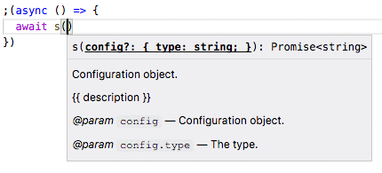
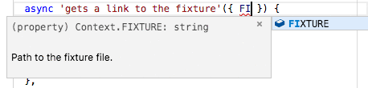

# mnp

[](https://npmjs.org/package/mnp)

`mnp` aka _My New Package_ is a global npm package which allows to quickly create a new _Node.js_ package with a default structure (`src`, `test`, `package.json`, _etc_) and initialise a _GitHub_ repository.

## Table Of Contents

- [Table Of Contents](#table-of-contents)
- [CLI: `mnp my-new-package`](#cli-mnp-my-new-package)
  * [Creating Packages](#creating-packages)
  * [`-I`, `--init`: Configure](#-i---init-configure)
  * [`-h`, `--help`: Show Help](#-h---help-show-help)
  * [`-c`, `--check`: Check Exists](#-c---check-check-exists)
  * [`-d`, `--delete`: Delete Repository](#-d---delete-delete-repository)
- [Structures](#structures)
  * [`Art Deco Node.js Package`](#art-deco-nodejs-package)
  * [Universal Koa Website](#universal-koa-website)
  * [Scripts](#scripts)
- [`Package` Structure](#package-structure)
  * [Main Function](#main-function)
  * [Test Suites](#test-suites)
    * [_snapshot-testing_](#_snapshot-testing_)
  * [Testing Context](#testing-context)
  * [Documentation with `doc`](#documentation-with-doc)
    * [`Examples` Embedding](#examples-embedding)
  * [Scripts in `Package.json`](#scripts-in-packagejson)
    * [Build With _À La Mode_](#build-with-_-la-mode_)
    * [Document With _Documentary_](#document-with-_documentary_)
    * [Test With _Zoroaster_](#test-with-_zoroaster_)
  * [_.alamoderc.json_](#_alamodercjson_)
  * [`launch.json` Debugging](#launchjson-debugging)
- [TODO](#todo)
- [Copyright](#copyright)


## CLI: `mnp my-new-package`

The default mode is to start creating a package. If `package-name` is not passed, the program will run in interactive mode and ask to enter details.

```sh
mnp [package-name] [-D description] [-s structure] [-cIhd]
```

To use the binary, enter `mnp cool-package-name`, or just `mnp` to be asked for the name. `mnp` will check if the directory does not exist and not in a git path, create a `Github` repository, star it, clone it to the local filesystem, and fill in the default _Node.js_ package structure.

<table>
<tbody>
<tr>
</tr>
<tr>
<td><a name="creating-packages">Creating Packages</a></td>
</tr>
<tr>
<td></td>
</tr></tbody></table>

### `-I`, `--init`: Configure

When launched for the first time, `mnp` will ask to complete the set-up process and create a `.mnprc` file in the directory from which it was called. It is possible to create a default `.mnprc` in the `HOME` directory to remember the token, and then initialise `mnp` in other directories, when it will reuse the token from the `HOME` config, but ask for more details for the current folder. This way, it is easy to manage different organisations and scopes, while reusing the access token.

| Field | Description |
| ----- | ----------- |
| `token` | A `GitHub` [developer token][1]. |
| `organisation` | An optional `GitHub` organisation name to create repositories for. A personal `GitHub` account is used if not supplied. |
| `name`, `email` | Author's name and email to set in the `package.json` file, and in the project directory's git config. Default values are read from the global git config. |
| `scope` | A scope with which to create packages. |
| `website` | A link location in the copyright section of the `README` file. |
| `trademark` | A display text for the website link in the `README`. |
| `legal name` | A legal name placed in the `LICENCE` file. |

<details>
  <summary>Initialising configuration: <code>mnp -I</code>.</summary>
  <table>
  <tr><td>
    
  </td></tr>
  </table>
</details>

### `-h`, `--help`: Show Help

<table>
<tbody>
<tr></tr>
<tr>
<td>

```
MNP: create My New Package.
 If no package name is given as the first argument, the program will ask
 for it in the CLI. A GitHub repository for each new package will be
 created automatically, and a GitHub token can be generated at:
 https://github.com/settings/tokens for the use in this application.
 The token is saved in the CWD/.mnprc file along with other configuration,
 including organisation name etc. Different types of packages, with a
 modern Node.js library by default are available, including:

+ package:	a modern Node.js package to publish on npm (default);
+ idio:		a JSX-powered Koa2 + React-Redux universal website;
+ structure:	an mnp template to create new structures.

  mnp [package-name] [-D description] [-s structure] [-cIhdv]

	package-name 	Name of the new or checked package.
	-D, --desc   	Description of the software.
	-s structure 	Which structure to use (package, idio, structure).
	-c, --check  	Check if the package name has been taken or not.
	-h, --help   	Print this information and quit.
	-d, --delete 	Delete a repository. Useful in testing.
	-v, --version	Show mnp version.
	--init, -I   	Initialise configuration in the local .mnprc file.

  Example:

    mnp my-new-package -s idio
```
</td>
</tr>
</tbody>
</table>

### `-c`, `--check`: Check Exists

Check if the package name is already taken or not.

```sh
mnp taken -c
```


```sh
mnp isfree -c
```


### `-d`, `--delete`: Delete Repository

Delete specified repository from `GitHub`. Useful when a package was created for testing. The organisation name will be read from the configuration.

```sh
mnp package -d
```


## Structures

There are a number of structures available. The default one is the `package` structure.

| Name | Description | Link |
| ---- | ----------- | ---- |
| `package` | <a name="art-deco-nodejs-package">`Art Deco Node.js Package`</a>. It has everything needed to create high-quality modern application with testing, building and documentation facilities. | [`@mnpjs/package`](https://github.com/mnpjs/package) |
| `idio` | A <a name="universal-koa-website">Universal Koa Website</a> that allows to write server-side JSX and provides Hot Module Reload. | [`mnp-idio`](https://github.com/artdecocode/mnp-idio) |
| structure | A structure for creating new structures with `mnp`. | [`@mnp/structure`](https://github.com/mnpjs/structure) |

### Scripts

At certain stages during the creation of a new package, `mnp` will run scripts specified in the `package.json` of a structure. For example, the `package` structure will run `yarn` to install dependencies right after the package is created.

Scripts should be specified in the `mnp` field of the `package.json` file either as a string, or an array, for example:

```json
{
  "name": "@mnpjs/package",
  "mnp": {
    "onCreate": [
      "yarn"
    ]
  }
}
```

If a script is given as a `.js` file which exists in the structure directory, it will be executed with Node.js:

```json
{
  "name": "@mnpjs/structure",
  "mnp": {
    "onCreate": "scripts/mkdir.js"
  }
}
```
## `Package` Structure

The default package structure is an up-to-date template of a modern Node.js application.

<table>
<tbody>
<tr></tr>
<tr>
<td>

```m
node_modules/@mnpjs/package/structure
├── .alamoderc.json
├── .eslintignore
├── .eslintrc
├── .gitignore
├── .vscode
│   └── launch.json
├── CHANGELOG.md
├── LICENSE
├── README.md
├── build
│   ├── index.js
│   └── index.js.map
├── documentary
│   ├── API
│   │   └── index.md
│   ├── footer.md
│   └── index.md
├── example
│   ├── example.js
│   └── index.js
├── package.json
├── src
│   └── index.js
├── test
│   ├── context
│   │   └── index.js
│   ├── fixture
│   │   └── test.txt
│   └── spec
│       └── default.js
└── yarn.lock
```
</td>
</tr>
</tbody>
</table>

It also includes `yarn.lock` file to speed up the installation process.
### Main Function

Every package will have a main file specified in the `main` field in the package.json file, unless they have a `bin` field otherwise (in other words, if package does not provide a Node.js API, and only CLI usage). This structure has a minimum example of working function which is exported with `export default` keyword, and documented with JSDoc. It's important to document the config argument in a `typedef` so that other developers are able to see the autocompletion hints when trying to use the function.

```js
import { debuglog } from 'util'

const LOG = debuglog('my-new-package')

/**
 * {{ description }}
 * @param {Config} config Configuration object.
 * @param {string} config.type The type.
 */
export default async function myNewPackage(config = {}) {
  const {
    type,
  } = config
  LOG('my-new-package called with %s', type)
  return type
}

/**
 * @typedef {Object} Config
 * @property {string} type The type.
 */
```


### Test Suites

The tests are found in the `test/spec` directory, and all necessary infrastructure in the `test` dir, including a `fixture` directory and optionally a `snapshot` directory if the package is using snapshot testing.

```m
node_modules/@mnpjs/package/structure/test
├── context
│   └── index.js
├── fixture
│   └── test.txt
└── spec
    └── default.js
```

The tests are written with `zoroaster` framework, which expects a file to export a test suite as an object, containing tests as its properties. Tests can be both asynchronous and synchronous, and `zoroaster/assert` includes a `throws` method to assert that the function throws, as well as `deepEqual` with color difference.

```js
import { equal, ok } from 'zoroaster/assert'
import Context from '../context'
import myNewPackage from '../../src'

/** @type {Object.<string, (c: Context)>} */
const T = {
  context: Context,
  'is a function'() {
    equal(typeof myNewPackage, 'function')
  },
  async 'calls package without error'() {
    await myNewPackage()
  },
  async 'gets a link to the fixture'({ FIXTURE }) {
    const res = await myNewPackage({
      type: FIXTURE,
    })
    ok(res, FIXTURE)
  },
}

export default T
```

If <a name="_snapshot-testing_">_snapshot-testing_</a> is required, it can be additionally installed with `yarn add -DE snapshot-context`. This will allow to write snapshot tests.
### Testing Context

The structure uses a test context -- a feature of `Zoroaster` that lets separate the set-up and tear-down methods from the test implementations. All common methods, e.g., reading a fixture file, should be implemented in the context and accessed via the destructuring capabilities of the JavaScript language. All clean-up code such as destroying a server, can be done in the `_destroy` method of the class.

```js
import { resolve } from 'path'
import { debuglog } from 'util'

const LOG = debuglog('my-new-package')

const FIXTURE = resolve(__dirname, '../fixture')

/**
 * A testing context for the package.
 */
export default class Context {
  async _init() {
    LOG('init context')
  }
  /**
   * Example method.
   */
  example() {
    return 'OK'
  }
  /**
   * Path to the fixture file.
   */
  get FIXTURE() {
    return resolve(FIXTURE, 'test.txt')
  }
  get SNAPSHOT_DIR() {
    return resolve(__dirname, '../snapshot')
  }
  async _destroy() {
    LOG('destroy context')
  }
}
```

When a context is used in tests, there's an access to the test context API:



Context testing also allows to split files into mulitple sub-directories much easier.

### Documentation with `doc`

The documentation is pre-processed with [`documentary`](https://github.com/artdecocode/documentary) which simplifies working on the `README.md` file by allowing to split files, and inserting examples and output text in the docs.

```m
node_modules/@mnpjs/package/structure/documentary
├── API
│   └── index.md
├── footer.md
└── index.md
```

To process documentation, the `yarn doc` command can be run.
#### `Examples` Embedding

The examples are extremely useful for people reading the documentation, and they also allow developers to manually check that everything works correctly in the package. `documentary` supports embedding of examples and their output, eliminating the need to copy those by hand. The examples are put in the `example` directory, and embedded in the README file with the following snippet:

```
%EXAMPLE: example example/example.js, ../src => mnp, javascript%
```

The output can be printed with the `FORK` command:

```
%FORK-json example example/example.js%
```

```js
/* yarn example/ */
import myNewPackage from '../src'

(async () => {
  await myNewPackage()
})()
```

Because the examples are written using `import` and `export` syntax, a `index.js` file is required which will include `alamode`:

```js
const { resolve } = require('path')
require('alamode')()

const p = resolve(__dirname, '..', process.argv[2])
require(p)
```

To provide a quick way to run examples, each of them needs to be [created a script](#particular-example) for in the `package.json`.
### Scripts in `Package.json`

The scripts are useful for testing, running in debugger, building and building documentation.

```json5
{
  "name": "my-new-package",
  "version": "0.0.0",
  "description": "{{ description }}",
  "main": "build",
  "scripts": {
    "t": "zoroaster -a",
    "test": "yarn t test/spec",
    "test-build": "ALAMODE_ENV=test-build yarn test",
    "test-all": "yarn-s test test-build",
    "test-watch": "yarn test -w",
    "lint": "eslint .",
    "doc": "NODE_DEBUG=doc doc documentary -o README.md",
    "b": "alamode src -o build",
    "build": "yarn-s b doc",
    "rec": "NODE_DEBUG=appshot appshot -T 23 -a Terminal -y 150 -f",
    "e": "node example",
    "example/": "yarn e example/example.js"
  },
  "files": [
    "build"
  ],
  "repository": {
    "type": "git",
    "url": "{{ git_url }}"
  },
  "keywords": [
    "{{ keywords }}"
  ],
  "author": "{{ author_name }} <{{ author_email }}>",
  "license": "MIT",
  "bugs": {
    "url": "{{ issues_url }}"
  },
  "homepage": "{{ readme_url }}",
  "devDependencies": {
    "alamode": "1.4.0",
    "documentary": "1.11.0",
    "eslint-config-artdeco": "1.0.1",
    "yarn-s": "1.1.0",
    "zoroaster": "3.0.0"
  }
}
```

The description of each script is as follows:

| Script | Meaning | Description |
| ------ | ------- | ----------- |
| `t` | Test a single file or directory. | To run: `yarn t test/spec/lib.js`. |
| `b` | <a name="build-with-_-la-mode_">Build With _À La Mode_</a>. | The package uses [`alamode`](https://github.com/a-la/alamode) to allow writing `import` and `export` statements. |
| `doc` | <a name="document-with-_documentary_">Document With _Documentary_</a>. | Is run with `yarn doc`, but is also a part of the `build` script. |
| `build` | Run `b` and `doc` in series. | Builds source code into the `build` directory, and compiles documentation to the `README.md` file. |
| `test` | <a name="test-with-_zoroaster_">Test With _Zoroaster_</a>. | Run all tests, `yarn test`. |
| `test-build` | Test build files. | Run all tests by requiring all files from the build directory and not the `src`. This is possible with the `babel-plugin-transform-rename-import` which changes `../src` to `../build` (also as part of a bigger path such as `../../src/lib`). |
| `e` | Run an example file. | Run specified example, e.g., `yarn e example/test.js`. |
| `example/` | Run a <a name="particular-example">particular example</a>. | A job specifically created as a short-hand for a particular example. |
| `lint` | Check code style. | `eslint` is not installed as a dependency, because it can be installed globally easily. It will also work in the IDE if installed globally fine. However, [`eslint-config-artdeco`](https://github.com/artdecocode/eslint-config-artdeco) config is specified as a dependency. |
### _.alamoderc.json_

`alamode` is a fast Regex-based JavaScript transpiler which is capable of transforming `import` and `export` statements into `require` calls and `module.export` assignments. Because the stable Node.js contains most in not all of the features that could be wanted by developers, except for the ECMAScript 6 modules, the code inside packages is transpiled with `alamode` either during the build process, or via a require hook. It also allows to substitute the path to the source directory, e.g., when testing the build with the `test-build` command when `ALAMODE_ENV` is set to `test-build`.

```json5
{
  "env": {
    "test-build": {
      "import": {
        "replacement": {
          "from": "^((../)+)src",
          "to": "$1build"
        }
      }
    }
  }
}
```
###  `launch.json` Debugging

Debugging is very useful and almost always required way to progress with a development of a software program. A new functionality can be introduced by writing the tests first, and then running them against the source code. That is, the `TDD` approach to testing can be summarised as having to somehow run the code being tested first, and the best place to put it in is a test file. By providing a quick sketch of tests, the program can then be debugged to see whether the execution flows as expected, and adjust it on-the-fly.

This explains the structure of the `launch.json` file, which will have a configuration to start `Zoroaster` testing in `watch` mode, so that it is not necessary to restart the Node process every time. Also, if changes are made during a pause at a breakpoint, the execution will need finish running completely first before a changed version can be run.

```json5
{
  // Use IntelliSense to learn about possible attributes.
  // Hover to view descriptions of existing attributes.
  // For more information, visit: https://go.microsoft.com/fwlink/?linkid=830387
  "version": "0.2.0",
  "configurations": [
    {
      "type": "node",
      "request": "launch",
      "name": "Launch Zoroaster",
      "program": "${workspaceFolder}/node_modules/.bin/zoroaster",
      "env": {
        "ZOROASTER_TIMEOUT": "9999999",
        "NODE_DEBUG": "my-new-package",
      },
      "console": "integratedTerminal",
      "args": [
        "test/spec",
        "-a",
        "-w",
      ],
      "skipFiles": [
        "<node_internals>/**/*.js"
      ]
    }
  ]
}
```

## TODO

- [ ] Binary Structure.
- [ ] Patch structures.
- [ ] Create own structures.
- [ ] Tags and Keywords.
## Copyright

(c) [Art Deco](https://artdeco.bz) 2018

[1]: https://github.com/settings/tokens
